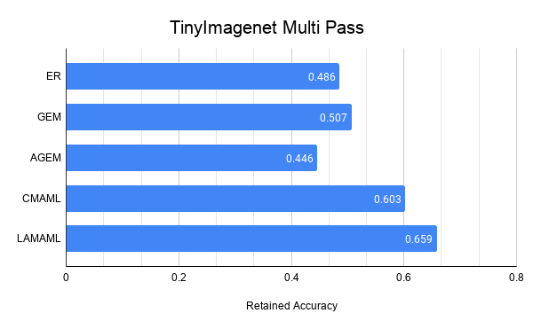

# 6883_final
6.883 Online Learning With Meta-Gradients in RL, this project builds off of the work done by the DeepMind team [here](https://github.com/deepmind/deepmind-research/tree/master/option_keyboard). Our project is comprised of two main subsecitons. In the first subsection we attemped to implement meta-gradient self tuning of the discount factor in DQN and GPE+GPI agents. Unfortunately becuase the codebase we were building off of used and old version of Tensorflow and Sonnet, it did not support the functionality we needed. We then transitioned our effort to reproducing the results of the [La-MAML paper](https://github.com/montrealrobotics/La-MAML) becuase it used many of the same elements (namely online learning using meta-gradients). This readme is also split into two sections, one half to the results of our meta-gradient self tuning experiments, the other half to our reproduction of La-MAML. 

## Discount Factor Online Self Tuning
Below is a table comparing the three hyperparameter tuning algorithms for DQN agents. Each algorithm was run for 100 agent lifetimes.

Method | Discount | Undiscounted Cumulative Reward
------------ | ------------- | -------------
Grid Search | 0.852 | 6.8885
Random Search | 0.912 | 6.9245
Bayesian Search | 0.885 | 7.0609

Below is a table comparing the three hyperparameter tuning algorithms for GPE+GPI agents. Each algorithm was run for 100 agent lifetimes.

Method | Discount | Undiscounted Cumulative Reward
------------ | ------------- | -------------
Grid Search | 0.772 | 3.711 
Random Search | 0.997 | 3.876
Bayesian Search | 0.864 | 3.923

## La-MAML
Below are our charts reproduced from the code [here](https://github.com/montrealrobotics/La-MAML).



### Setup for meta-gradient self tuning workspace
Use below command to setup virtualenv, only specify --python if you need to:
```
virtualenv --python=/usr/bin/python3.7 venv
```

Activate this virtualenv:
```
source venv/bin/activate
```

Install the python libraries:
```
pip install -r option_keyboard/requirements.txt
```

### Train the DQN baseline
```
python -m option_keyboard.run_dqn
```

### Train the self-tuning DQN
```
python -m option_keyboard.run_meta_dqn
```

### Train the Option Keyboard and agent
```
python -m option_keyboard.run_ok
```

### Our Files (for 6.883, not from Deepmind)
#### In the main branch:
- meta_dqn_agent.py
- run_meta_dqn.py
#### In the parameter-tuning branch:
- run_hyperparameter_search.py
- hp_optimizers.py
- run_bayesian.py
- run_grid_search.py
- run_random_search.py
- test.py

